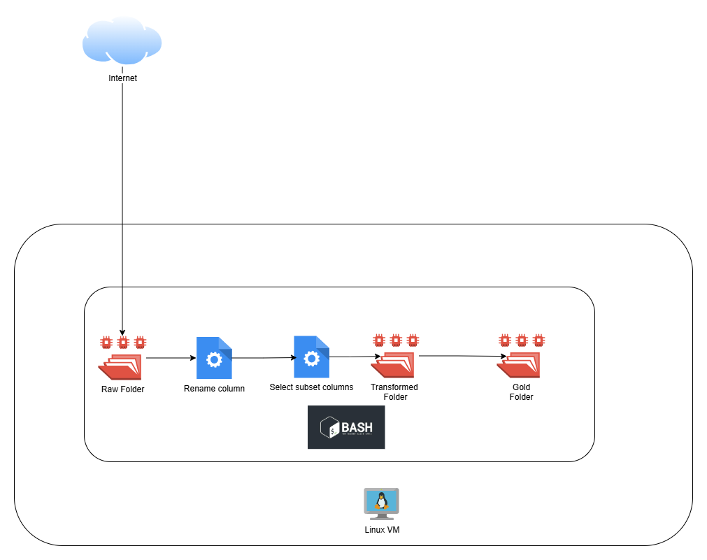

# Linux ETL Assignment

## Architectural Diagram

# Documentation
## Question 1

Find the script [here](./scripts/bash_scripts/etl.sh)
The URL of the file to be downloaded is retrieved from the .env file.

### Extract
The extract destination folder is created, then checks if files exists. If file does not exist, proceed to download, else we exit the code.

### Transform
After ensuring that the transformed destination folder exists, `sed` command is used to rename columns `Variable_code` to `variable_code`. Then use `awk` command to select specific columns onlyand redirect the result to a file using `>`. Then validation is done to confirm the error code returned in a zero error code and that the transformed file exists.

### Load
After ensuring that the gold destination folder exists. Then the transformed file is copied to the gold layer folder. Validation is done to confirm the error code returned in a zero error code and that the transformed file exists.

## Question 2
To schedule the script to run at 12:00 AM daily. The crontab linux command is used with a cron expression `0 0 * * *`. In the [schedule_etl.sh](./scripts/bash_scripts/schedule_etl.sh) script, we get the path of the script to be run, couple it with the cron expression and then adds it to the existing crontab list for the user.

Find the script [here](./scripts/bash_scripts/schedule_etl.sh)

## Question 3
The script [move_json_and_csv.sh](./scripts/bash_scripts/move_json_and_csv.sh) takes only the source folder we want to move the csv and json files from and hve the destination folder `json_and_CSV` in the script.

It created the destination folder if not exist and moves all .csv & .json from from the souce folder to the target/destination folder.

Find the script [here](./scripts/bash_scripts/move_json_and_csv.sh)

## Question 4
In the script, we have an array, containing the URL's of all files we want to fetch. In the folder [here](./scripts/sql_scripts/), we have 3 sql scripts, 1 to create the databas `posey`, another to create a postgres schema, named `posey`, and lastly another to contain all the DDL's for needed tables.
First we create all these needed database object, then use a for loop to iteratively go over the array, check if the file is exisitng and download incase its not, then proceed to looad the data into a postgres table using psql command line tool.

The sql script for the question asked by Manager Ayoola, can be found [here](./scripts/sql_scripts/sql_answers.sql)

Find the script [here](./scripts/bash_scripts/parch_posey_postgres_ingest.sh)